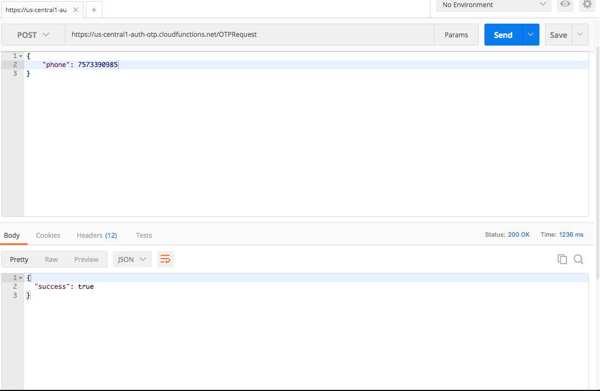

# Cloud functions

Google Cloud functions to assist with OTP creation and verification in the project firebase-otp-auth

## Getting Started

Quite a few steps to set this up on your local projects first two must are a firebase annd twilio account.
You must upgrade your firebase account to a 'Blaze' pay as you go plan as Google does not allow use of third
party apis in its cloud function for free use. And if for production you must also associate a card with your twilio account.

### Prerequisites

you will need firebase CLI tools, and a project Id from your firebase account. There are two files that need filling out of your
personal Twilio and firebase base info named, ServiceAccount.json, and twilio.js. Also in the OTPRequest.js file you will need
to add your twilio created phone number in accordingly.

```
Give examples
```

### Installing

install firebase tools

```
npm install -g firebase-tools
```

login to firebase on CLI
enter email and PW

```
firebase login
```

git clone this repository

```
git clone https://github.com/milesaylward/cloud-function-auth.git
```

navigate to function folder and npm install

```
cd functions sudo npm install
```

copy project id from firebase
under project settings
deploy functions to project

```
firebase deploy --project YOUR-PROJECT-ID
```


## Running the tests

To test that everything was done correctly you can download the postman extension
for chrome and for a test post request to your personal cell phone number that you added twilio (not the number you created with twilio your actual cell number). Under post go to body, raw, and json add a phone number as show in image below.
If it succeeds you should see the image below saying success and recieve a 6 digit code from twilio.
You may test the signup feature the exact same way and the verify otp
by passing in the phone and the code you received into the json form on postman.



## Deployment

For an example of using these cloud based functions in a live project see my repo where I add these to a react native project.
* [React Native Implementation](https://github.com/milesaylward/firebase-otp-auth)

## Built With

* [Firebase](http://www.dropwizard.io/1.0.2/docs/) - The web framework used
* [Twilio](https://maven.apache.org/) - Dependency Management

## Authors

* **Miles Aylward** - *Initial work* - [PurpleBooth](https://github.com/milesaylward)

## License

This project is licensed under the MIT License
